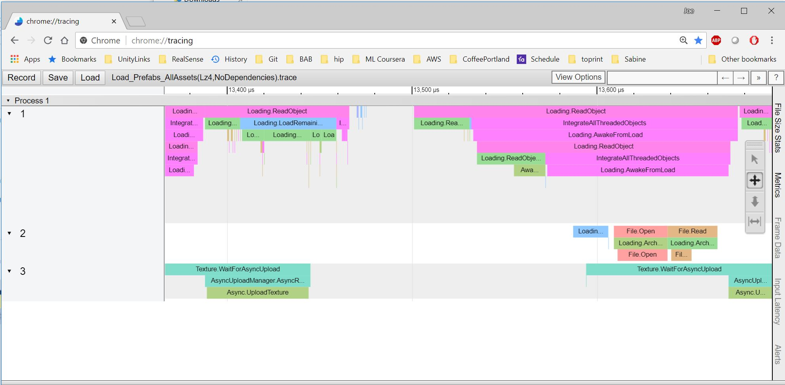

The Trace Event Profiler package allows you to capture performance data to the Trace Event Format described [here](https://docs.google.com/document/d/1CvAClvFfyA5R-PhYUmn5OOQtYMH4h6I0nSsKchNAySU/edit).

Supported platforms include OSX, Windows, and Android.

Captures can be started and ended from script using the TraceEventProfiler.TraceProfiler class.

```cs
using TraceEventProfiler;

...

TraceProfiler.BeginCapture("MyCaptureFile.trace");

// Perform work here

TraceProfiler.EndCapture();

```

Once captured, the trace file can be viewed by entering the chrome://tracing URL in Google Chrome
||